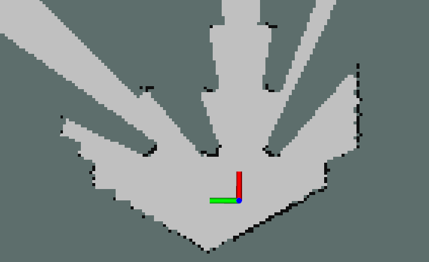

# raycast_mapping_ros


[](https://opensource.org/licenses/MIT)

ROS implementation of Ray Casting Update Algorithm for 2D Mapping

<p align="center">
  
</p>

## Environment
- Ubuntu 20.04
- ROS Noetic

## Install and Build
```
# clone repository
cd /path/to/your/catkin_ws/src
git clone https://github.com/ToshikiNakamura0412/raycast_mapping_ros.git

# build
cd /path/to/your/catkin_ws
rosdep install -riy --from-paths src --rosdistro noetic     # Install dependencies
catkin build raycast_mapping_ros -DCMAKE_BUILD_TYPE=Release # Release build is recommended
```

## How to use
```
roslaunch raycast_mapping_ros raycast_mapping.launch
```

## Running the demo
```
# clone repository
cd /path/to/your/catkin_ws/src
git clone https://github.com/ToshikiNakamura0412/scan_to_pcl_ros.git
git clone -b noetic-devel https://github.com/ROBOTIS-GIT/turtlebot3_msgs.git
git clone -b noetic-devel https://github.com/ROBOTIS-GIT/turtlebot3.git
git clone -b noetic-devel https://github.com/ROBOTIS-GIT/turtlebot3_simulations.git

# build
cd /path/to/your/catkin_ws
rosdep install -riy --from-paths src --rosdistro noetic
catkin build -DCMAKE_BUILD_TYPE=Release

# run demo
export TURTLEBOT3_MODEL=burger
roslaunch raycast_mapping_ros test.launch
```

## Node I/O


## Nodes
### raycast_mapping
#### Published Topics
- /local_map (`nav_msgs/OccupancyGrid`)
  - Local map data

#### Subscribed Topics
- /cloud (`sensor_msgs/PointCloud2`)
  - Input point cloud data

#### Parameters
- ~\<name>/<b>map_reso</b> (float, default: `0.05` [m/cell]):<br>
  The resolution of the map
- ~\<name>/<b>map_size</b> (float, default: `10.0` [m]):<br>
  The size of the map
- ~\<name>/<b>yaw_reso</b> (float, default: `0.087` [rad]):<br>
  The resolution of the yaw angle for ray casting

## References
- https://myenigma.hatenablog.com/entry/20140714/1405343128
